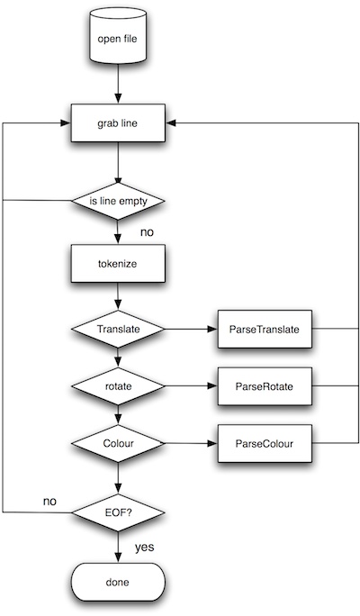

# Files and Serialisation

## Introduction
- C  programs can store results & information permanently on disk using file handling functions 
- These functions let you write either text or binary data to a file, and read this information back later
- All file access is controlled by a file pointer :-
  - a pointer to a structure which is created when you open a file 
  - contains information about the file you opened 
  - Once the file is opened, refer to file via this pointer, NOT by its name. 
- The file pointer is a variable of type [FILE](http://www.cplusplus.com/reference/cstdio/FILE/) 

## [FILE *](http://www.cplusplus.com/reference/cstdio/FILE/)
- FILE * is a complex structure which holds information about the file system.
- This information differs from different operating systems, and file system types.
- To make the C language portable an abstraction is used
- The C library contains a number of file access functions which use the FILE * abstraction to process the information

## C++ File operations
- C++ provides a number of classes to perform output and input of characters to / from files
- These are specified to allow read, write, and read / write
- Unlike C these classes have different names as follows
  - [ofstream](http://www.cplusplus.com/reference/fstream/ofstream/) :  a stream class to write to files
  - [ifstream](http://www.cplusplus.com/reference/fstream/ifstream/) :  a stream class to read from files
  - [fstream](http://www.cplusplus.com/reference/fstream/fstream/) :  a stream class to both read and write from/to files.

## Opening a file
- To open a file we need to create a file object of the correct type.
- Once this is done we use the open method to see if the file can be accessed.
- In the following example we open a file for writing too
```
std::ifstream FileIn;

FileIn.open(argv[1]);
// check to see if we can open the file
if (!FileIn.is_open())
{
  std::cerr <<"Could not open File : "<<argv[1]<<" for writing \n";
  exit(EXIT_FAILURE);
}

```
## Stream I/O
- When a file is opened a file descriptor is returned and this file descriptor is used for each subsequent I/O operation, when any operation is carried out on the file descriptor its is known as a stream.
- When a stream is opened the stream object created is used for all subsequent file operations not the file name.

## [open](http://www.cplusplus.com/reference/fstream/ifstream/open/)
- The open method takes two parameters.
- By default we only need to specify one which is the name of the file to access.
- However we can pass an additional mode parameter which allows us to specify different operations such as read/write. 
- Also we can specify if the data is to be written as text (default) or binary 

## IO Modes
|    flag value | opening mode |
|---------------|--------------|
|```ios_base::app``` | (append) Set the stream's position indicator to the end of the stream before each output operation.|
|```ios_base::ate``` | (at end) Set the stream's position indicator to the end of the stream on opening.|
|```ios_base::binary``` | (binary) Consider stream as binary rather than text.|
|```ios_base::in``` | (input) Allow input operations on the stream.|
|```ios_base::out``` | (output) Allow output operations on the stream.|
|```ios_base::trunc``` | (truncate) Any current content is discarded, assuming a length of zero on opening.|


## checking if file opened
- Once the stream object’s open method has been called we can check to see if it was successful 
```
if (!FileIn.is_open())
{
  std::cerr <<"Could not open File : "<<argv[1]<<" for writing \n";
  exit(EXIT_FAILURE);
}
```

## closing a file close
- when a program finishes with a file it should close it using close method
```
FileOut.close();
``` 
- close performs housekeeping tasks such as flushing (emptying) buffers and breaking connections with the stream object. 
## Reading and writing a Stream
- Once a stream has been opened there are three types of unformatted I/O which may be performed these are as follow
  1. Character at a time I/O. 
  2. Line at a time I/O
  3. Direct I/O

## Access to the file
- Once the stream object is associated to a file we use the insertion and extraction operators to read and write data
- ```<<``` is the insertion operator and can be used to write data to the stream object
- ```>>``` is the extraction operator and can be used to read data from the stream object
- These operators are overloaded to work with all standard data types
- There are also a number of methods for character / line at a time I/O
- [insetion.cpp](https://github.com/NCCA/FilesAndParsing/blob/master/FileIO/insertion.cpp)
- [extraction.cpp](https://github.com/NCCA/FilesAndParsing/blob/master/FileIO/extraction.cpp)

## Input Functions
- To input a character we use the get method
- This inputs a character at a time from the specified stream
- This is shown in the following [example](https://github.com/NCCA/FilesAndParsing/blob/master/FileIO/FileCp.cpp).

## Line at a time I/O
- The previous functions have all used character at a time processing.
- When dealing with text files we can use line at a time I/O
- The line is usually terminated with the newline character \n
- If we are writing a line we place the NULL (\0) char to specify the end.
## [Line Input](http://www.cplusplus.com/reference/string/string/getline/)
- Line at a time input is provided by the following function
```
std::istream& getline (std::istream& is, std::string& str, char delim);	
std::istream& getline (std::istream& is, std::string& str);
```
- This function is passed an open stream to read from
- A string object to read the data too
- Additionally we can specify a delimiter to specify when to terminate the current read operation
- By default this is the \n character but we can change this to any character we like.
- see [ReadLine.cpp](https://github.com/NCCA/FilesAndParsing/blob/master/FileIO/ReadLine.cpp)
## Reading from the console
- it is possible to read from the console a line at a time using getline and [std::cin](http://en.cppreference.com/w/cpp/io/cin)
- see [LineRead.cpp](https://github.com/NCCA/FilesAndParsing/blob/master/FileIO/LineRead.cpp)

## Binary I/O
- The previous functions operated with either one character at a time or a line at a time
- Sometimes desirable to read or write complete structures to or from a file. 
- This is done using the  binary I/O functions [read](http://www.cplusplus.com/reference/istream/istream/read/) and [write](http://www.cplusplus.com/reference/ostream/ostream/write/)
```
std::istream& read (char* s, streamsize n);
std::ostream& write (const char* s, streamsize n);
```
- [BinaryWrite.cpp](https://github.com/NCCA/FilesAndParsing/blob/master/FileIO/BinaryWrite.cpp) and [BinaryRead.cpp](https://github.com/NCCA/FilesAndParsing/blob/master/FileIO/BinaryRead.cpp) show this in action.

## Problems
- The problem with the previous example is the data members are public.
- This is because we need to read and write the data directly into the attributes
- Also we rely on the fact that the attributes are packed in contiguous memory blocks
- To overcome this problem we can use object serialisation however this must either be written for each object 
- Or we can use a 3rd Party library

## [friend](http://en.cppreference.com/w/cpp/language/friend) 
- friends are functions or classes declared with the friend keyword.
- If we want to declare an external function as friend of a class, thus allowing this function to have access to the private and protected members of this class, we do it by declaring a prototype of - this external function within the class, and preceding it with the keyword friend :
- Generally, the use of friend functions is out of an object-oriented programming methodology, so whenever possible it is better to use members of the same class to perform operations with them.

## [boost::serialization](http://www.boost.org/doc/libs/1_62_0/libs/serialization/doc/)
- The boost serialization classes must be friends to the class we wish to serialize
- We also need to add the library to the search path 
- and link in the binary library to our project
```
INCLUDEPATH+=include
INCLUDEPATH +=/usr/local/boost
LIBS+=-L/usr/local/lib
LIBS+=-lboost_serialization
DEPENDPATH=include
```
- this can be seen in the demo program [here](https://github.com/NCCA/FilesAndParsing/tree/master/BoostSerialization)

# Positioning a stream
- There are several functions which allow the programmer to move the current position of the file stream. 
- These are as follows
  - [seekg](http://www.cplusplus.com/reference/istream/istream/seekg/) and [seekp])http://www.cplusplus.com/reference/ostream/ostream/seekp/. allow us to move to a position in the stream
  - [tellg](http://www.cplusplus.com/reference/ostream/ostream/tellg/) and [tellp](http://www.cplusplus.com/reference/ostream/ostream/tellp/) allow us to determine the current position in the stream.
- These functions allow us to change the position of the get and put stream pointers. 
- Using this  the stream pointer is changed to the absolute position position (counting from the beginning of the file). The type for this parameter is the same as the one returned by functions tellg and tellp: the member type pos_type, which is an integer value.
- if using the position element prototype of the function we use the following values to determine the direction


|value	|offset is relative to...
|-------|------------------------|
|```ios_base::beg``` |	beginning of the stream |
|```ios_base::cur``` |	current position in the stream |
|```ios_base::end``` | end of the stream |

## Parsing Text Files
- It is common to want to read information from a config file and setup a programs state dependent upon the information in the file
- One of the easiest methods is to read the text file a line at a time and split the line into tokens which can be acted upon
- Boost provides us with a nice tokenizer template which we can use in our code.

## Simple Scene File
```
Colour R G B 
Translate x y z
Rotate angle x y z
Sphere Radius sX sZ
Cube width
```

## Code Outline
- The program will open the file then grab a line at a time.
- If the line is not empty
- We tokenize and then parse the outcome based on the first token we find.

 

- [Parser Project](https://github.com/NCCA/FilesAndParsing/tree/master/BoostTokenizer)

## Python File I/O
- Python File I/O is very similar to C / C++ 
- Python also has a number of libraries which make text / file processing very easy
- We shall look at more of these libraries at a later date but for now the following examples show basic file operations
- see the code [here](https://github.com/NCCA/FilesAndParsing/tree/master/Python) for some basic examples


## References
- [C Files](https://en.wikipedia.org/wiki/C_file_input/output)